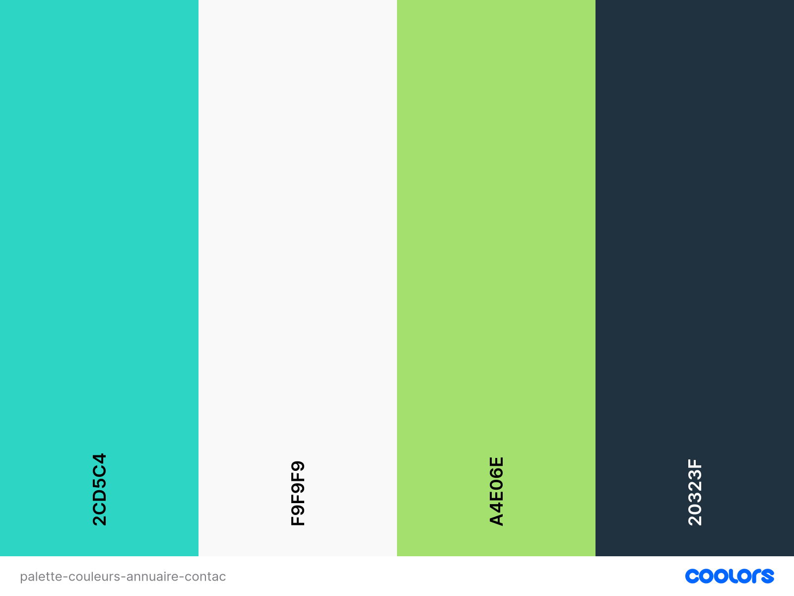
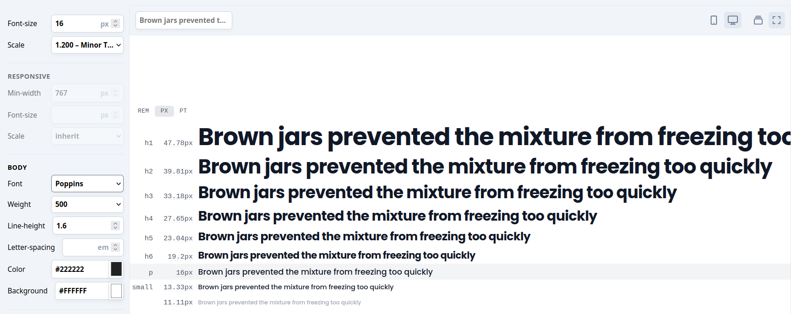
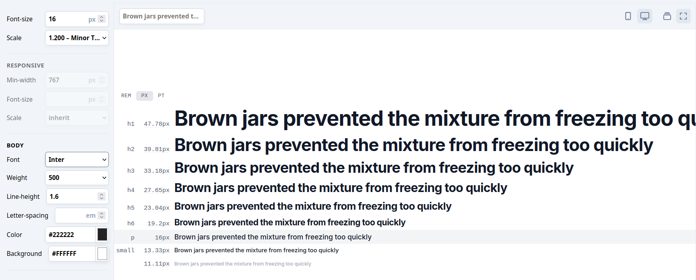
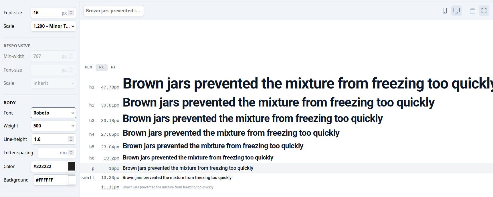

# CHARTE GRAPHIQUE DE L'ANNUAIRE DE CONTACTS

La charte graphique à pour but de définir toutes les règles visuelles à suivre pour garantir une identité visuelle cohérente sur l’ensemble du PROJET.

## LOGO: 

## Palette de couleurs du site : PDC 

L'anniare de contacts utlise 4 couleurs  principales pour sa conception, chacune ayant un rôle paticulier dans la création de son identité visuelle ee l'expérience utilisateur.

| Couleur          | Rôle                                      | Code hex   |
|------------------|-------------------------------------------|------------|
| Bleu turquoise   | Boutons / Appels à l'action / liens       | `#2CD5C4`  |
| Blanc            | Fond clair / zones secondaires            | `#1F9F9F9` |
| Bleu marine      | Texte / titres /contrastes                | `#20323F`  |
| Vert lumiere     | Validation / icônes, badges, boutons secondaires | `#A4E06E`  |

Lien Coolors 👉 [https://coolors.co/2cd5c4-f9f9f9-a4e06e-20323f)

---

## Choix Typographiques

### Police de Titres : **Poppins**

Polices très lisibles pour les titres et sous-titres 

### Police de texte standard (pragraphe) : **Inter** 

Polices très lisibles et élégantes pour les paragraphes 
- Utilisée pour : Textes courants, descriptions  
- Style : Moderne, fluide, très lisible  

### Police de Liens : **Roboto** 
    
   

### Recommandations Tailwind : Police Poppins, Inter et Roboto

| Élément          | Police       | Taille (ex.) | Style                |
|------------------|--------------|--------------|----------------------|
| Titre principal  | Poppins      | `text-5xl`   | `uppercase`          |
| Sous-titre       | Poppins      | `text-3xl`   | `uppercase`          |
| Texte standard   | Inter        | `text-base`  | `font-light` à `font-semibold` |
| Boutons CTA      | Roboto       | `text-lg`    | `uppercase font-bold` |

### Type scale police Ex : Police Poppins, Inter et Roboto

